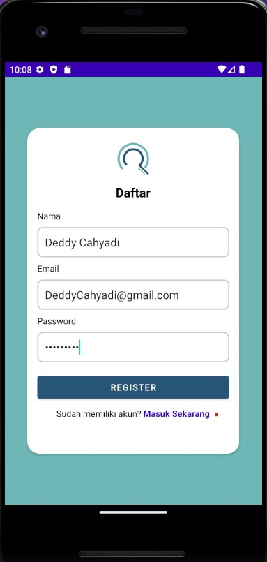
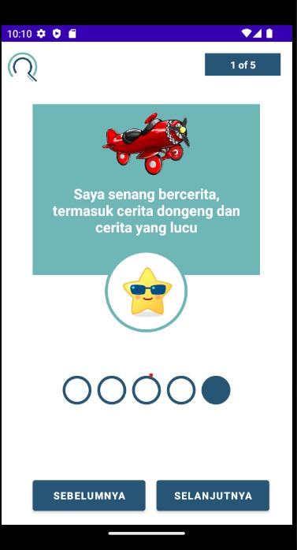
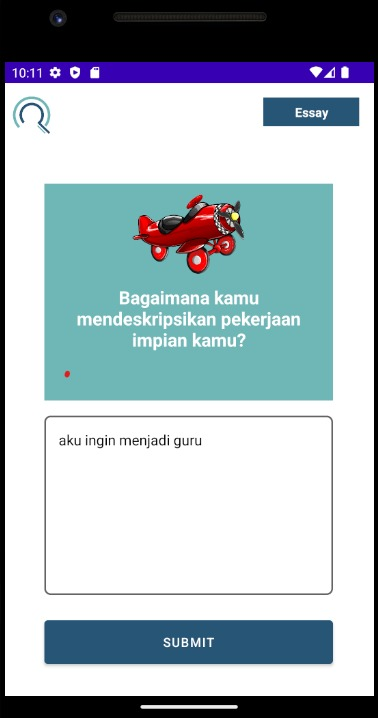

# MD-InFentorApp

  

# InFentorApps
InFenTor is a mobile app designed to address the lack of understanding of children's intelligence types in Indonesia. Many children struggle with determining their potential careers and choosing a role model. In response to these challenges, InFenTor offers a solution by providing a user-friendly application to measure children's intelligence types and identify potential careers. The app utilizes a basis of multiple intelligences developed by Howard Gardner.

Using the app is simple: children answer intelligence-related questions, and the application generates personalized results. These results include the child's intelligence type, potential career paths, and famous figures who share the same career, serving as role models.

# Team Profile

### Team ID : C22-PS177
### This is our Members

* (ML) M312DKX4522 – Zulfikar Zahir Hamdani – Defense University 
* (ML) M288DSY0525– Tasya Rizkia Unsabila –  Yogyakarta State University 
* (CC) C360DSX3359 – Muhammad Hanif Firmansyah – Telkom University  
* (CC) C204DSX3234 – Hasbi Al Farabi – Islamic University of Riau 
* (MD) A360DSX3281 – Syahdi Gharizah Ahsan – Telkom University 
* (MD) A360DSX3163– Muhammad Ichsan Alfian– Telkom University 

**Case:**

- [x] determination of the dominant type of intelligence from eight types of intelligence
- [x] Recommend suitable job types
- [x] Glossary list Type of intelligence

## Screenshots

  
  
  
  
  
  
  

## Development Roadmap
- [x] [Kotlin](https://kotlinlang.org/)
- [x] [Glide](https://github.com/bumptech/glide)
- [x] [Retrofit](https://square.github.io/retrofit/).

## Features
- [x] Login
- [x] Register
- [x] Home
- [x] Opinion Scale question
- [x] Essay question
- [x] Result
- [x] Glossary

## Thank You :)
